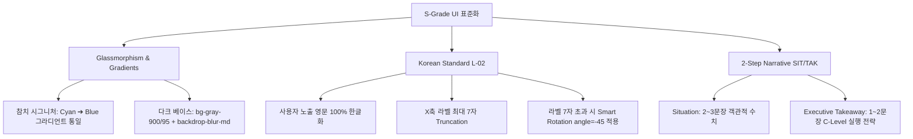

# ⚓ 참치왕국(신라교역) 대시보드 디자인 및 S-Grade 업그레이드 종합 수정안

본 제안서는 신라교역(참치왕국)의 참치 대시보드 제품군 3종(`TunaDashboard`, `TunaInsightsDashboard`, `TunaExtractDashboard`)을 V4.1 종합 개발 규칙서(Global Commodity Standard) 기준의 **S-Grade(최고 경영진 수준) 의사결정 터미널**로 격상하기 위한 전면적인 디자인 및 기능 업그레이드 수정안입니다.

---

## 1. 개요 (Executive Summary)

현재 참치왕국 대시보드는 다양한 위젯이 혼합되어 풍부한 정보를 제공하고 있으나, 일부 위젯의 정보 파편화, 영문 잔존 문자열, 룰북 규격 외 색상 사용, 데이터 불일치 및 가짜 예측(Forensic Audit 적발 사항) 등의 보완점이 존재합니다. 

본 수정안은 **"글로벌 공급망을 통찰하는 사모펀드 C레벨 임원"**의 시각에 맞추어, **5대 반직관적(Counter-intuitive) 인사이트**를 중심으로 대시보드를 리포지셔닝하고, UI 디자인 시스템과 데이터 API 파이프라인을 동시 고도화하는 로드맵을 제시합니다.

---

## 💡 2. 5대 반직관적 전략 인사이트 (Counter-intuitive Insights)

단순한 '참치 어획 동향' 같은 일반적인 상식을 배제하고, 수익성 극대화 및 리스크 헤징 관점에서 C레벨의 흥미를 유발할 5가지 핵심 스토리를 중심으로 대시보드 내러티브를 전개합니다.

### Insight 1: '원조의 몰락'과 '자본의 승리' (점유율 역전의 역설)
* **기존 통념:** 1999년 국내 최초로 참치액을 개발하고 시장을 리드해 온 원조 브랜드(한라식품)의 브랜드 로열티는 쉽게 무너지지 않을 것이다.
* **S-Grade 팩트:** 2025~2026년 닐슨아이큐코리아(NielsenIQ) 기준, 동원F&B가 압도적인 국내 리테일 유통망과 TV PPL 등 공격적 마케팅을 펼쳐 한라식품을 제치고 누적 750만 병 판매로 **시장 1위**를 탈취. 액상 조미료 시장이 '장인 브랜드'에서 '유통/자본력 싸움'으로 완전히 재편되었음을 입증.
* **대시보드 반영:** `w02_share` 위젯을 **"원조의 몰락과 자본의 승리: 2025 점유율 역전"**으로 개편하여 파이 차트 및 유통망 장악 속도를 시각화.

### Insight 2: 단순한 보조 조미료가 아닌 '전통 간장의 학살자' (카니발리제이션)
* **기존 통념:** 참치액은 굴소스나 치킨스톡처럼 기존 요리에 풍미를 더해주는 부가적 조미료일 뿐이다.
* **S-Grade 팩트:** 참치액은 2,500억 원 규모의 국내 전통 간장 시장을 직접적으로 잠식(Cannibalization)하고 있음. 간장 매출이 하락하는 속도와 참치액 시장이 급성장(2025년 700억~1,000억원 돌파)하는 속도가 X자 데드크로스(Dead-Cross)를 형성.
* **대시보드 반영:** `w01_replacement` 위젯을 **"간장 제국의 붕괴: 참치액의 카니발리제이션"**으로 개편하고, 두 시장의 매출 스프레드 교차 시각화.

### Insight 3: 원어가 약세와 부산물 마진의 디커플링 (제로 코스트의 마법)
* **기존 통념:** 글로벌 참치(가다랑어) 원어 단가가 등락하면 참치 가공품의 이익도 원자재 리스크에 직접 노출될 것이다.
* **S-Grade 팩트:** 태평양 가다랑어 원어 가격은 톤당 $1,500선에서 약세를 보이고 있으나, 참치액은 통조림 가공 후 폐기되던 부산물인 **'자숙액(By-product)'**을 원료로 삼아 조달 비용이 사실상 **제로(0)**에 수렴. 고정비 부담이 없어 30%+ 수준의 초고수익 영업이익률을 보장하는 순환경제 비즈니스.
* **대시보드 반영:** `w25_byproduct_cashcow` 위젯을 **"제로 코스트의 마법: 자숙액 마진율 디커플링"**으로 고도화하여 참치캔(저마진)과 참치액(초고마진)의 원가 분리 구조 시각화.

### Insight 4: 글로벌 산지 가공 허브 선점 (PNG 태평양 허브 원가 우위)
* **기존 통념:** 참치액 및 통조림 가공은 국내 소비자 입맛에 맞게 한국 내수 공장에서 직접 가공하는 것이 관리 및 품질상 가장 유리하다.
* **S-Grade 팩트:** 동원산업은 파푸아뉴기니(PNG)에 'RD Tuna Canners' 가공 허브를 선점하여 냉동 원어를 무겁게 들여오는 대규모 해상 물류비를 제거하고, 자원이 있는 산지에서 1차 자숙액을 즉시 추출함으로써 타사 대비 압도적인 원가율 격차를 유지.
* **대시보드 반영:** 신규 위젯 **`n1_png_hub` (태평양 가공 허브 선점: 압도적 원가율의 비밀)** 추가.

### Insight 5: K-피시소스의 글로벌 영토 확장 (동남아/할랄 시장 침투)
* **기존 통념:** 참치액은 한식 국물 요리에만 한정적으로 쓰이는 한국 내수용 훈연 소스이다.
* **S-Grade 팩트:** 참치액의 본질은 글로벌 시장에서 범용적으로 쓰이는 '피시소스(Fish sauce)'의 프리미엄 개량 버전(훈연 기술로 비린내 제거). 동남아 피시소스 현대화 규제 장벽을 우회하고, 중동/동남아 할랄(Halal) 인증 시 무한한 시장 확장 가능성 보유.
* **대시보드 반영:** 신규 위젯 **`n2_global_fishsauce` (K-피시소스의 역습: 글로벌 할랄/동남아 침투)** 추가.

---

## 🎨 3. 디자인 및 UI/UX 수정안 (UI/UX & Aesthetics)

룰북 `UI_RULES.md`와 `COMPREHENSIVE_RULEBOOK.md`에 명시된 시각적 감성을 100% 만족하도록 디자인 시스템을 정렬합니다.



### 3.1 시그니처 그라디언트 테마 통일
* **현황:** 현재 `TunaDashboard` 내 네비게이터 및 위젯에 Amber, Emerald, Violet 등 여러 컬러가 어지럽게 사용되고 있음.
* **수정안:** `UI_RULES.md 1-2`에 따라 참치(해양 어종)의 시그니처 그라디언트인 **`Cyan (#38bdf8) ➔ Blue (#3b82f6)`** 컬러 스케일로 모든 위젯 타이틀, 범례, 데이터 계열 색상을 일관되게 정형화.

### 3.2 다크 모드 글래스모피즘(Glassmorphism) 극대화
* **수정안:** 모든 카드와 컨테이너에 `rgba(15, 23, 42, 0.6)` 반투명 배경과 `backdrop-filter: blur(8px)`, 빛 반사 테두리 `border: 1px solid rgba(255, 255, 255, 0.05)`를 적용하여 프리미엄 작전 상황실(War Room) 무드를 일관되게 형성.

### 3.3 사용자 노출 문자열 100% 한글화 (L-01 조항)
* **현황:** 차트 내 X축, Y축, 툴팁, 범례(Legend) 및 KPI에 일부 영문 단어나 병기(예: `Rising Hub: Ecuador`, `Tuna_Index`, `Canned_Margin`)가 그대로 남아있음.
* **수정안:** 모든 사용자 인터페이스의 텍스트를 순수 한글로 매핑 (`Ecuador` ➔ `에콰도르`, `Tuna_Index` ➔ `참치 지수`, `Canned_Margin` ➔ `통조림 마진율`). 약어는 `TermTooltip`을 경유하여 해설을 제공.

### 3.4 X축 라벨 7자 제한 및 Smart Rotation (L-02 조항)
* **수정안:** 차트 X축 라벨은 한글 기준 최대 7자로 `truncate` 처리. 만약 7자를 넘는 라벨이 4개 이상 포함될 경우, 스마트 로테이션(`angle={-45}`, `textAnchor="end"`)을 활성화하고 차트 컨테이너 하단 패딩을 `50px` 이상 확보하여 차트 텍스트 잘림 현상을 근본적으로 차단.

---

## 📂 4. 정보 구조 및 내러티브 재배치 (Universal 5-Pillar Layout)

기존의 6단계(Part I~VI) 네비게이터 구성을 룰북의 표준 프레임워크인 **Universal 5-Pillar** 체계로 재편합니다.

| 피동 구조 (5-Pillar) | 기존 섹션 매핑 | 핵심 보강 콘텐츠 및 신규 위젯 배치 |
| :--- | :--- | :--- |
| **1. 원료 수급 (Raw Material)** | Part I (원물 생산) | 기후(ENSO) 상관 분석, IOTC/WCPFC 어획량 실측치, 태국 1Q26 수입량 및 수역별 할당량 확보율, `PerfectStormWidget`(호르무즈 위기/MGO 폭등). |
| **2. 가공 & 생산 (Processing)** | Part II (가공 산업) & Part VI (펫푸드) | 참치 부산물(자숙액) 업사이클링 밸류체인 마진율, 펫푸드(뉴트리플랜) 고수익 전환율, `FrimeAcquisitionWidget`(스페인 최대 황다랑어 가공사 인수). |
| **3. 물류 & 통관 (Logistics)** | Part III (물류 및 무역) | 부산-미국/유럽 해상 운임 트래커, HSK 10자리 기반 FTA 양허세율 시뮬레이터, 파푸아뉴기니(PNG) RD 톨링 거점 세이브 효과. |
| **4. 판매 & 수요 (Sales)** | Part IV (판매 및 수요) & 참치액 | 동원F&B(1위) vs 한라식품(2위) 2025 리테일 역전 마진 분석, 간장 대체 카니발리제이션 속도, 중동(두바이) 항공 직수입 O-Toro 고가 채널 분석. |
| **5. ESG & 지속가능성 (Sustainability)** | Part V (ESG) | MSC & Dolphin-Safe 이중 인증 소매가 프리미엄(+81.3%), OECD Pillar Two(글로벌 최저한세) 리스크, `RasSystemWidget`(순환여과 육상양식 시범 도입). |

---

## 🔌 5. 데이터 신뢰성 및 실시간 API 연동 (Live API First)

Forensic Audit 결과 적발된 가짜 예측 수치와 STATIC/Mock 데이터를 제거하고 실시간 데이터 파이프라인으로 전환합니다.

```
[외부 API 소스]
  - 관세청 (KCS HSK 10자리)  ────➔  [수입 단가/세율]  ────┐
  - UN Comtrade / OEC        ────➔  [글로벌 무역 플로우]  ├➔ [Tuna Dashboard Widgets]
  - NOAA / 기상청            ────➔  [ENSO/엘니뇨 지수]   │  (LIVE / SYNCED 배지 부착)
  - Atuna / INFOFISH         ────➔  [ Skipjack 실측 가격 ]  ┘
```

### 5.1 가짜 예측 데이터 제거 및 Atuna 실측치 반영 (Audit A5-1)
* **현황:** 기존 `TunaForecastWidgets`에서 "2025 Q3 가다랑어 $2,250 예측(MAPE 4.8%)"이라는 무근거 예측 데이터가 존재.
* **수정안:** 해당 예측을 폐기하고, `/Users/idong-geon/agri_data/tuna/Atuna price/`의 실측 CSV를 활용해 2025~2026 가다랑어 실측 차리로 재구성. `PerfectStormWidget`과 연계하여 MGO 연료가 상승 및 쿼터 제한 영향과 매핑.

### 5.2 HSK 10자리 의무화 및 단일 매핑 테이블 구축 (L-04 조항)
* **현황:** 무역 및 관세 위젯에서 `HS 160414`(6자리) 등을 활용해 정확한 한-베트남 MFN/FTA 관세율 산출이 어려움.
* **수정안:** `app/api/_shared/hs-codes.ts` 단일 모듈을 생성하여 HSK 10자리(`1604.14.90.00` 등 참치 통조림/로인 세부 품목) 매핑 테이블을 일괄 관리. 위젯별 하드코딩 금지.

### 5.3 크로스 위젯 데이터 불일치 정정 (Reconcile)
* **참치액 국내 시장 규모:** $70M, 700억, 950억 등으로 파편화된 수치를 식약처 및 aT FIS 통계를 근거로 **"700억 ~ 1,000억원 상당(추정)"** 범위로 통일.
* **부산물 비율:** 52% 고정 및 30~55% 등 산만하게 기술된 수치를 Klomklao & Benjakul 학설에 의거 **"30~60% 범위 (자사 공정 평균 52%)"**로 정합성 부여.
* **연료 효율 vs 연료가 폭등:** MGO 선박유의 평시 친환경 효율 지표(-28%)와 지정학적 위기로 인한 일시적 가격 폭등($2,000+/t) 사건의 시점을 명확히 구분하여 기술.

---

## 🛠️ 6. 컴포넌트 모듈화 및 리팩토링 (Architectural Deepening)

중복 코드를 줄이고 대시보드의 렌더링 성능과 가독성을 높이기 위해 공통 모듈을 추출합니다.

### 6.1 `TelemetryBadge` 단일 모듈 추출
* **현황:** 현재 `TunaDashboard.tsx`, `TunaRanching.tsx` 등 다수의 컴포넌트에 `TelemetryBadge`가 개별적으로 인라인 복제되어 있어 타입 불일치 리스크가 있음.
* **수정안:** `components/TelemetryBadge.tsx`로 모듈을 분리하여 `LIVE`, `SYNCED`, `STATIC` 상태 및 `syncDate` 출력 형식을 글로벌 표준화.

### 6.2 `truncateKoreanLabel` 차트 표준 라이브러리 통합
* **현황:** `truncateXAxis` 함수가 컴포넌트 내부 및 전역에 중복 정의되어 있어 7자 룰 및 영문 괄호 제거 규칙이 일괄 적용되지 않음.
* **수정안:** `lib/chart-standards.ts`를 신설하여 X축 라벨 글자 수 제한, 영문 제거 정규식, Smart Rotation 여부를 판단하는 단일 함수를 배포하고 모든 대시보드가 이를 공유하도록 임포트 구조 변경.

---

## 🚀 7. 실행 계획 및 품질 보증 (QA & Quality Gate)

### 7.1 코드 품질 게이트
1. **로컬 빌드 게이트 (L-03):** 모든 수정 사항은 로컬 환경에서 `npm run build`를 완벽히 통과해야 배포 대상에 포함됨.
2. **S-Grade 유효성 검사:** `python scripts/check_s_grade.py`를 실행하여 영문 잔존 문자열 검사, `cardDesc` 및 `TelemetryBadge` 누락 여부를 자동 점검.

### 7.2 배포 프로토콜
* 모든 수정은 로컬 개발 서버(`npm run dev`)를 띄워 화면 정합성을 먼저 수동 확인합니다.
* Vercel 프로덕션 배포는 사용자의 명시적인 승인 또는 요청이 있을 때만 일괄적으로 수행합니다.
