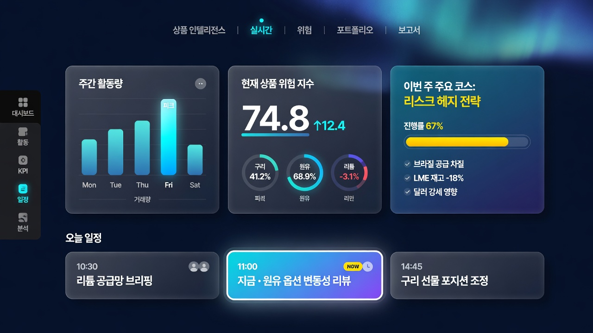
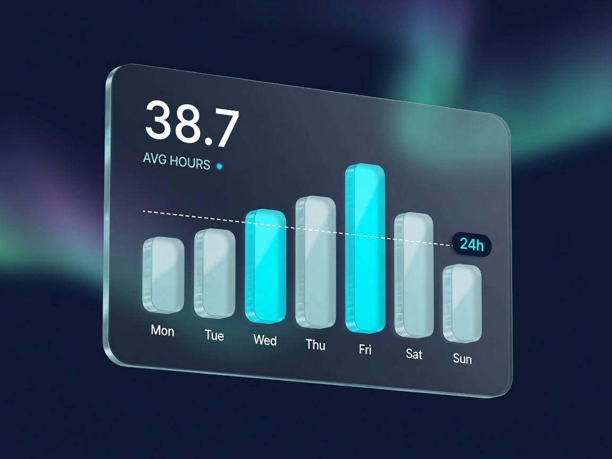
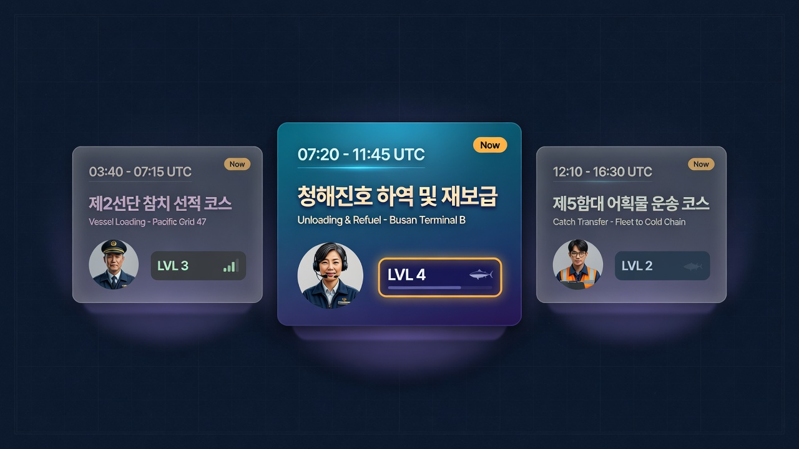

# 참치왕국 Command Deck 3.0 — 시각 고도화 기획서

| 항목 | 내용 |
| --- | --- |
| 대상 | `https://leedonggun.co.kr` (tuna-dashboard / 참치왕국) |
| 성격 | **시각·공간 계층만** 한 단계 올린다. 데이터 계약·위젯 클레임·라우트는 바꾸지 않는다. |
| 레퍼런스 | 첨부 Mondly 러닝 대시보드 (라이트, 대형 수치, 입체 막대, Now 카드) |
| 작성 | 2026-08-16 [Grok] |
| 상태 | 기획 제출 → **기존 docs 대조 반영 (같은 날 개정).** 구현·배포 전 사용자 승인 필요. |
| 대조한 폴더 | `/Users/idong-geon/my-project/tuna-dashboard/docs` + 그 checkout의 `scratch/design-bundle`, `scratch/redesign-concepts` |

---

## 0. 한 줄 결론

Mondly의 **라이트 컨슈머 UI를 이식하지 않는다.** 그 계열은 이미 `scratch/redesign-concepts/concept-2-light-saas.html`로 그려 두었고, 런타임에 올라간 것은 **concept-4 Aurora**다.

이번 작업은 새 테마가 아니다. **Aurora 다음 한 단계**다. 가져올 것은 색이 아니라 **공간 문법**이다.

- 카드가 표의 칸이 아니라 **책상 위 물체**처럼 떠 있을 것
- 핵심 숫자는 **차트보다 먼저** 읽힐 것
- 오늘 할 일(Now)은 **한 장만** 앞으로 나올 것
- 막대는 납작한 SVG가 아니라 **두께가 있는 기둥**처럼 보일 것

기존 War Room / Deep Ocean Aurora 다크 글래스는 유지한다.  
라이트 테마 전환, 전면 WebGL, 위젯 전수 3D 틸트는 범위 밖이다.

---

## 0.1 기존 문서 대조 — 이 기획이 어디에 앉는가

사용자가 지정한 `/Users/idong-geon/my-project/tuna-dashboard`는 **이 워크트리와 다른 checkout**이다.

| | 이 워크트리 | 지정 폴더의 루트 |
| --- | --- | --- |
| 경로 | `…/orca/workspaces/tuna-dashboard/참치왕국` | `/Users/idong-geon/my-project/tuna-dashboard` |
| 브랜치 | `codex/fleet-production-2025` | `mackerel/claude-etl` |
| HEAD | `2b510d8` | `cfc1a48` |

지정 `docs/`에만 있는 것: 고등어·오징어·골뱅이 전면 개편, Codex/OpenCode 지시서, 참치 1차출처 `sources/`.  
이 워크트리 `docs/`에만 있는 것: 본 기획서와 시안 3장.

시각 결정은 **지정 checkout의 선행 문서가 정본에 가깝다.** 아래에서 충돌을 먼저 닫는다.

### 이미 있는 시각 자산 (다시 만들지 말 것)

| 자산 | 위치 | 이번 기획과의 관계 |
| --- | --- | --- |
| 리디자인 4안 | `scratch/redesign-concepts/concept-1-terminal.html` · `concept-2-light-saas.html` · `concept-3-editorial.html` · `concept-4-aurora.html` | **concept-4가 현 런타임.** Mondly는 concept-2(라이트 SaaS) 쪽이다. 4안을 다시 공모하지 않는다. |
| 디자인 카탈로그 37장 | `scratch/design-bundle/` + `SPEC.md` | Foundations / 그라디언트 / WidgetCard / Hero KPI band가 **이미 있다.** 신규 카드는 VolumeBar·NowCard·알약 네비 3장만 추가. |
| Claude Design 동기화 기획 | `docs/2026_claude_design_proposal.md` (2026-06-27, 승인 대기) | DesignSync 권한에 막혀 있다. **구현을 여기에 묶지 않는다.** 코드가 진실, 카탈로그는 거울. |
| 시안→코드 절차 | `docs/workflows/2026_design_to_code.md` | 준수. VolumeBar/NowCard/HeroMetric은 TSX 전에 `design-bundle` 정적 HTML 1장씩. |
| Hero KPI 템플릿 | `scratch/design-bundle/layouts/hero-kpi.html` | 숫자 1.6rem, 카드 `#181818`. 이번 기획의 44px는 이 템플릿을 **키우는 것**이지 신설이 아니다. |
| 공통 셸·팩토리 | `docs/2026_dashboard_radical_improvement_proposal.md` 축 C | 알약 네비·레일은 이 축의 실행이다. 대시보드 35개를 각자 손대지 않는다. |

`SPEC.md`는 추출 시점의 토큰이다. 지금 `globals.css`와 어긋난다 (예: 당시 `--card-radius: 12px`·Spotify `#1ed760`, 현재 16px·emerald `#10b981`). P0에서 SPEC을 런타임에서 다시 뽑는다. 카탈로그를 옛 값으로 되돌리지 않는다.

### 시각보다 앞선 트랙 — 파일럿에서 제외

| 문서 | 한 줄 | 이번 기획에 대한 구속 |
| --- | --- | --- |
| `all_pages_review_2026-06-11.md` | 결함의 중심은 데이터가 아니라 **정직성 계층** | 예쁜 거짓 금지. 시각 PR에 SIT/숫자/LIVE 변경 혼입 시 거부. |
| `market_vnext_plan_2026-06-10.md` | `/market` 첫 화면 정직화(모순 시세·오늘자 라벨)가 P0 | `/market` 히어로를 키우기 **전에** 같은 화면 숫자 모순이 남아 있으면 정직화가 먼저. 합성 지수 신설 금지(이미 §6.2). |
| `MACKEREL_REVAMP_PLAN_2026-08-13.md` | 범위에서 **디자인 시스템 변경 제외** | `/mackerel` 파일럿·개별 리터치 금지. |
| `SQUID_REDESIGN_2026-08_PLAN.md` | 화려함 아님. 위젯 축소·근거 표시 | `/squid` 제외. |
| `WHELK_REDESIGN_PLAN_2026-08-13.md` | “예쁘게 다시 만드는 일이 아니라 데이터와 화면을 일치” | `/whelk` 제외. |
| `docs/2026-08-13_shrimp_redesign_spec.md` (이 워크트리) | 아카이브→위젯 ETL | `/shrimp` 제외. |
| ADR 0008 | `FleetStrategyMatrix` · `SEAsiaOEMDashboard` · `RetailPOS` · `StrategyIntel`은 WidgetCard 강제 금지 | 토큰(radius/shadow)은 CSS로 스며들 수 있다. 구조 wrap·Now 슬롯 신설은 하지 않는다. StrategyIntel의 기존 3D 플립과 VolumeBar를 섞지 않는다. |

### 이미 끝난 부채 (다시 제안하지 말 것)

`2026_dashboard_radical_improvement_proposal.md`(2026-07-02)의 “테스트 0·lint 비활성·JSON 직접 import”는 이후 해소됐다. 현재 워크트리 기준 `npm run verify` 게이트와 `lib/data/` 인테이크가 있다. 이번 기획은 그 안전망 **위에서** 토큰·셸만 올린다.

### 이 대조가 바꾼 것

1. 테마 공모 종료. Aurora 유지.
2. 파일럿은 운영 셸 + `/market`(정직성 잔여 점검 후) + `/fleet` + `/unloading`. 품목 개편 중인 페이지는 제외.
3. 구현 순서: `design-bundle` HTML 3장 → 토큰/`WidgetCard` → 파일럿 TSX. Claude Design 업로드는 선택.

---

## 1. 왜 지금인가

라이브 사이트는 이미 C레벨 인텔리전스로서 정보는 충분하다. 부족한 것은 정보량이 아니라 **한 화면이 “비싸다”고 느껴지는 물성**이다.

현재 화면은 다음 네 가지가 겹쳐 “대시보드 템플릿”으로 읽힌다.

1. **모든 카드가 같은 높이** — hover `translateY(-2px)`와 cyan 글로우만 있다.
2. **핵심 수치가 작다** — 토큰상 히어로 숫자는 `--font-3xl`(32px)까지인데, 시장 KPI는 `--font-xl`(20px) 근처에서 멈춘다. Mondly는 24,9 / 64%를 화면의 주인공으로 쓴다.
3. **막대가 납작하다** — Recharts `Bar` + `--chart-bar-radius: 2px`. 하이라이트 기둥, 기준선 배지, 옆면 하이라이트가 없다.
4. **크롬이 목록형** — 좌측 사이드바 + 영어 suffix(`Market`, `Fleet`) + 긴 메뉴. Mondly의 알약 네비·기간 칩·Now 타일이 주는 “한 장의 제품” 느낌이 없다.

첨부 레퍼런스가 비싼 이유는 데이터가 많아서가 아니다. **무엇이 앞에 있고 무엇이 뒤에 있는지**가 분명해서다.

---

## 2. 현재 자산 (As-Is)

이미 깔려 있는 것을 버리고 새로 만들지 않는다.

| 자산 | 위치 | 이번 기획에서의 역할 |
| --- | --- | --- |
| Deep Ocean Aurora 토큰 | `app/globals.css` | 배경·글래스·시그니처 cyan의 단일 출처. 확장만 한다. |
| `WidgetCard` | `components/WidgetCard.tsx` + `.module.css` | 100+ 위젯 공통 크롬. **여기만 올리면 전 품목이 같이 올라간다.** |
| `.ds-card` / 그라디언트 링 | `app/globals.css` | 1px 굴절 보더는 유지. 외곽 네온 글로우는 줄인다. |
| `AmbientBackground` | `components/AmbientBackground.tsx` | 오로라는 유지하되 채도를 낮춰 카드가 이기게 한다. |
| Framer Motion | 이미 의존성 | 셸·히어로·Now 카드 전용. 위젯 전수 루프 금지. |
| `react-countup` | 이미 의존성 | 히어로 KPI 진입 시에만. |
| `three` / `react-globe.gl` | `PacificGlobe`, `financial-risk` | **L3 장면 3D**. 신규 페이지에 기본 탑재하지 않는다. |
| 5-Pillar 상단 액센트 | `WidgetCard.module.css` | 기둥 색은 유지. 두께만 1.5px → 2px. |

구현에 새 라이브러리는 기본값으로 넣지 않는다.  
`@react-three/fiber`, GSAP, 커스텀 커서, 라이트 테마 토글은 이번 범위에서 제외한다.

---

## 3. 레퍼런스 해체 — 가져올 것 / 버릴 것

Mondly 화면을 통째로 베끼면 참치왕국이 **학습 앱**으로 보인다. 아래만 가져온다.

### 3-1. 가져올 공간 문법 8개

| # | Mondly에서 관찰된 것 | 참치왕국으로의 번역 |
| --- | --- | --- |
| 1 | 캔버스(라벤더 그레이) 위에 흰 카드가 떠 있음 | 심연(`#05070f`) 위에 글래스 카드가 **더 불투명하게** 뜸 |
| 2 | 24,9 / 64% 초대형 숫자 | 시장·선단·하역 히어로 KPI를 40–48px 테이블러 숫자로 |
| 3 | 막대 7개 + 한 기둥만 채도 상승 + 점선 기준선 | 주간/요일/선박 비교 막대에 `VolumeBar` 적용 |
| 4 | 일정 3장 중 가운데만 솔리드 필 + Now 칩 | 운영 화면의 **지금 판단 1건**만 솔리드 |
| 5 | 알약 네비 (Courses / Dashboard / …) | **실시간 운영 4메뉴**만 로컬 알약. 전역 30+ 메뉴는 사이드바 유지 |
| 6 | 24px 가까운 큰 라운드 + 확산 그림자 | `--radius-card: 22px`, 글로우 대신 틴트 그림자 |
| 7 | 비대칭 벤토 (세로 활동 + 통계 + 코스) | 2열 강제 그리드를 히어로만 2fr / 1fr / 1fr로 |
| 8 | 진행률이 물리적인 노란 필 | 하역·VDS·코스 진행은 **트랙+필**로. 도넛 남용 금지 |

### 3-2. 명시적으로 버리는 것

- 라이트 배경, 퍼플 프라이머리, EdTech 카피
- 아바타 클러스터·강사 초상·LVL 게이미피케이션
- 전 카드 3D 틸트, 홀로그램 포일, 커스텀 커서
- 영문 크롬 (`AVG HOURS`, `Now`만 남기고 본문은 한글)
- 시안 이미지에 나온 구리·원유·LME 카피 — **도메인 오염. 구현 금지.**
- 위젯 `cardDesc` / SIT / TAK / TelemetryBadge 삭제
- 정적 데이터에 `LIVE` 부착 (L-09)

### 3-3. 방향 시안 (분위기만. 카피·수치는 비정본)

이미지 생성 모델이 만든 화면이다. 한글이 일부 맞더라도 **숫자·품목·선박명은 가짜**다. 구현 스펙이 아니다.

**시안 A — 커맨드 덱 전체 밀도**



가져올 것: 알약 상단, 떠 있는 글래스, 대형 숫자, 가운데 Now 타일.  
버릴 것: 사이드 아이콘 레일 전면 교체, “상품 위험 지수” 같은 합성 KPI, 영문 요일 축.

**시안 B — 입체 막대 물성**



가져올 것: 유리 카드, 둥근 기둥, 한 기둥만 점등, 점선 기준선+배지, 약한 원근.  
버릴 것: 카드 전체를 기울여 두는 상시 3D(가독성·모바일 모두 해로움). 원근은 **호버 중인 히어로 카드에만** 1–2°.

**시안 C — Now 카드의 앞/뒤**



가져올 것: 비활성 글래스 vs 솔리드 필, 노란 Now 칩, 가운데만 떠 있음.  
버릴 것: 초상, LVL, 세 장 모두 Now, 가상의 선박명.

---

## 4. 디자인 원칙

### 4-1. Dial (이번 작업의 고정값)

기존 UI_RULES(워룸) + 레퍼런스(여백·물성)를 섞으면 밀도가 충돌한다. 이번 고도화는 아래 다이얼로 고정한다.

| Dial | 값 | 의미 |
| --- | --- | --- |
| DESIGN_VARIANCE | 6 | 히어로는 비대칭. 위젯 본문은 기존 2열 유지. |
| MOTION_INTENSITY | 5 | CSS 스프링 + 진입 스태거. 무한 루프는 상태점 1개만. |
| VISUAL_DENSITY | 5 | 갤러리도 콕핏도 아님. 임원이 10초 안에 숫자 3개를 읽게. |

### 4-2. Do

1. **숫자 > 장식.** 히어로 숫자와 단위 `(원/kg)`, `($/MT)`, `(MT)`가 차트보다 크다.
2. **높이 계층 4단.** 0 캔버스 / 1 카드 / 2 Now·hover / 3 모달·커맨드 팔레트.
3. **악센트는 cyan 하나.** 5-Pillar 색은 카드 상단 2px 바에만. 화면 전체 네온 금지.
4. **변환은 transform / opacity만.** `top`·`height` 애니메이션 금지.
5. **한 화면 주인공 1개.** `/market`은 시세, `/fleet`은 오늘 판단, `/unloading`은 누적 MT.
6. **L-07.** 같은 시각 변경을 위젯 5개 이상 손대지 않는다. 토큰과 `WidgetCard`로 일괄.

### 4-3. Don't

1. `#000` 순흑, Inter, 그라디언트 대제목 남발(이미 `--title-gradient`가 있음 — 페이지 타이틀 1곳에만).
2. 카드 안을 다시 점선 박스로 가두는 `.chartContainer` 패턴.
3. hover마다 바이올렛 글로우를 키우는 것. 그림자는 배경 색으로 틴트한다.
4. 이모지를 구조 아이콘으로 쓰는 것. 사이드바 섹션 타이틀의 📡🐟는 후속 패스에서 Lucide로 교체.
5. 라이트 모드 병행. 이번 작업은 다크 단일.

---

## 5. 3D 전략 — 세 층

“3D를 넣자”를 WebGL로 해석하지 않는다. 체감 퀄리티의 80%는 1층에서 나온다.

```
L3  장면 3D     Three / globe     선단 맵·태평양 구 등 기존 1곳
L2  공간 3D     CSS + SVG         히어로 틸트, VolumeBar, Now 리프트
L1  재질 3D     CSS tokens        굴절 보더, 확산 그림자, 내부 하이라이트
```

### 5-1. L1 재질 3D — 전 화면 (필수)

카드를 “유리 타일”로 재정의한다.

```css
/* 추가 토큰안 — 기존 변수는 이름 유지, 값만 교체 */
--radius-card: 22px;
--radius-pill: 999px;
--hero-number: 2.75rem;          /* 44px */
--hero-number-unit: 0.875rem;

--elev-0: none;
--elev-1: 0 12px 40px -16px rgba(2, 8, 24, 0.72),
          inset 0 1px 0 rgba(255, 255, 255, 0.08);
--elev-2: 0 22px 56px -18px rgba(2, 8, 24, 0.82),
          0 0 0 1px rgba(56, 189, 248, 0.18),
          inset 0 1px 0 rgba(255, 255, 255, 0.12);
--elev-3: 0 32px 80px -12px rgba(2, 8, 24, 0.88);

--card-bg: rgba(16, 24, 46, 0.78);     /* 지금보다 불투명 — 뒤 오로라가 글을 먹지 않게 */
--card-blur: blur(18px) saturate(1.08);
```

규칙:

- `box-shadow`의 세 번째 레이어에 **cyan 아우터 글로우를 넣지 않는다.** 지금은 `--card-shadow`에 `0 0 28px rgba(34,211,238,0.05)`가 있다. 확산 그림자로 대체.
- 내부 하이라이트(`inset 0 1px`)가 “유리 엣지”를 만든다. 이게 Mondly 카드가 비싸 보이는 이유의 절반이다.
- `backdrop-filter`는 **보이는 카드에만.** `display:none` KeepAlive 패널까지 blur를 돌리지 않는다(이미 숨김 패널 이슈가 있었음).

### 5-2. L2 공간 3D — 히어로만 (선택적, 파일럿)

**A. VolumeBar (입체 막대)**

Recharts `Bar`의 `shape`로 SVG 3면 기둥을 그린다. Three.js 아님.

```
   ┌─ top (더 밝은 cyan)
  /│
 / │  front (본색)
│  │
│  └─ side (12–18% 어두운 동일 색상)
└────
```

- 라운드 상단 `rx=8`
- 시리즈에서 **최댓값 1개만** 본색, 나머지는 동일 색 28–35% 투명
- 기준선은 `ReferenceLine` + 한글 배지 (`주 평균 4.2시간`이 아니라 해당 위젯의 실제 단위)
- 진입 시 높이만 `scaleY` (transform). 데이터 값은 처음부터 DOM에 존재
- `prefers-reduced-motion: reduce`면 즉시 최종 높이

적용 우선: `/market` 주간·월간 비교, `/fleet` 일간 어획, `/unloading` 연도별 누적.  
전 위젯 일괄 교체는 P2에서 `scripts/`로.

**B. 히어로 카드 틸트**

- 대상: 화면당 **최대 3장** (시장 히어로 KPI, 선단 Now, 하역 누적)
- 포인터 기준 `rotateX/Y` ±4° 이하. `perspective: 900px`
- `useMotionValue` (렌더 루프 금지). 터치 디바이스는 틸트 없음, press `scale(0.985)`만
- 상시 기울어진 카드(시안 B)는 금지 — 숫자의 수직이 무너진다

**C. Now 리프트**

Mondly 가운데 보라 카드의 번역.

- 비활성 슬롯: `--elev-1`, 글래스, 텍스트 `--text-secondary`
- 활성 슬롯: 시그니처 그라디언트 필(참치=cyan→blue), `--elev-2`, 노란 `지금` 칩
- 동시에 활성은 **1장**
- 데이터: `/fleet` 오늘의 운영 판단 1건, `/unloading` 진행 중 항차, `/market` 당일 스프레드 요약

### 5-3. L3 장면 3D — 기존만 (확장 금지)

`PacificGlobe`와 `/financial-risk` 글로브는 그대로 둔다.  
신규 위젯에 지구본·파티클·메시 그라디언트 캔버스를 추가하지 않는다.  
이유는 번들 예산(`npm run check:bundle`)과 메인스레드 16ms 예산이다.

---

## 6. 화면별 적용

전 품목을 동시에 다시 그리지 않는다. **셸 + 운영 3화면**이 체감 전부다.

### 6-1. 앱 셸 (좌측 레일 + 메인 캔버스)

지금: 긴 섹션 리스트, 로고, 영어 suffix, 하단 외부 링크.

목표:

```
┌──────── 72px rail ────────┬────────────── canvas ──────────────┐
│ 로고(아이콘)               │  [시장] [선단] [하역] [물류]   ⌘K  │
│ 운영 4 · 어종 · 농축 · 전략│  페이지 타이틀          기간 칩    │
│ (아이콘, hover에 한글)     │                                    │
│                            │   히어로 벤토                      │
│ 잠금 상태                  │   위젯 2열                         │
└────────────────────────────┴────────────────────────────────────┘
```

- 전역 알약 네비는 **운영 4개만.** 나머지 30+는 레일.
- 사이드바 영어 suffix는 제거하거나 `TermTooltip` 뒤로. L-01.
- 섹션 이모지(📡🐟)는 Lucide로.
- 메인 배경은 `--bg-abyss` 유지. 오로라 orb 채도 약 30% 하향.

모바일(<768): 레일 숨김, 기존 햄버거 유지. 알약 네비는 가로 스크롤.

### 6-2. `/market` — 파일럿 1

주인공: Atuna SKJ 방콕 달러.

```
[ SKJ 방콕 $1,900  기준일 ] [ YF ] [ USD/KRW ] [ MGO ]
     ↑ 44px 히어로              ↑ 보조 KPI 3

[ 시세 추이 — VolumeBar + 라인 오버레이          ] [ 당일 스프레드 Now ]
[ 기존 WidgetCard 그리드 유지                              ]
```

- 숫자는 기존 `/api/atuna-prices` 계약 그대로. 시안에 나온 74.8 같은 합성 지수 신설 금지.
- 히어로 3장만 틸트 허용.

### 6-3. `/fleet` — 파일럿 2

주인공: 오늘의 운영 판단 1건.

```
[ 주간 MT ] [ 8월 누계 ] [ 연간 누계 ]

[ 판단 A (글래스) ] [ 판단 Now (솔리드) ] [ 판단 C (글래스) ]
[ 기존 4탭: 오늘의 운영 / 선박·수역 / 실적 / VDS ]
```

- Now 카드 본문은 기존 판단 문장을 옮긴다. 새 내러티브 작성 금지.
- 선박 초상·LVL 게이지 금지. 선박명은 로스터 이니셜 또는 Lucide `Ship`.

### 6-4. `/unloading` — 파일럿 3

주인공: 검증 누적 MT + 진행 항차.

- 연도 탭 알약화
- 진행 중 항차 1척만 Now 솔리드
- 역사 표는 입체화하지 않는다 (밀도 우선, 테이블은 테이블)

### 6-5. 품목 대시보드 (`/value-chain`, `/shrimp` …)

P0에서 `WidgetCard` 토큰만 갈아끼운다. 품목 파일은 열지 않는다.

- 라운드 22px, `--elev-1`, 내부 하이라이트
- 차트 점선 박스 제거
- KPI 숫자에 `font-variant-numeric: tabular-nums` + 크기 한 단계 상향
- TakeawayBox·TelemetryBadge·cardDesc는 위치·의무 유지 (W-04)

개별 레이아웃 재배치는 **별도 오더.**  
`/mackerel` `/squid` `/whelk` `/shrimp`는 데이터 개편 트랙이 진행 중이다. 시각 파일럿·VolumeBar 일괄(P2)에서도 **제외**한다.

---

## 7. 컴포넌트 명세서 (구현 시)

신규 파일은 최소화한다.

| 컴포넌트 | 형태 | 책임 | 금지 |
| --- | --- | --- | --- |
| 토큰 패치 | `app/globals.css` | radius / elev / hero-number / card-bg | 기존 변수명 삭제 |
| `WidgetCard` 시각 | `.module.css`만 | hover를 elev-2로, 글로우 제거 | props·데이터 계약 변경 |
| `VolumeBar` | `components/charts/VolumeBar.tsx` | Recharts custom shape | three, 애니메이션 height |
| `HeroMetric` | `components/HeroMetric.tsx` | 44px 숫자 + 단위 + 기준일 + 선택 틸트 | 가짜 LIVE |
| `NowCard` | `components/NowCard.tsx` | 1장 솔리드 슬롯 | 복수 active |
| 셸 알약 | `app/page.tsx` + `page.module.css` | 운영 4 로컬 네비 | 전 메뉴 알약화 |

`'use client'`는 틸트·모션 leaf에만. 차트 shape는 순수 함수.

---

## 8. 단계와 공수

| 단계 | 범위 | 완료 조건 | 예상 |
| --- | --- | --- | --- |
| **P0-a 시안 카드** | `scratch/design-bundle`에 Hero(44px)·VolumeBar·NowCard HTML 3장 + `SPEC.md`를 현 `globals.css`로 재추출 | 워크플로 `2026_design_to_code.md` 충족. DesignSync 업로드는 선택 | 0.5 작업 단위 |
| **P0-b 토큰·셸** | globals + WidgetCard CSS + 운영 알약 네비 + 사이드바 L-01 | 전 품목 카드가 더 불투명·더 둥글·글로우 감소. `npm run verify` | 1 작업 단위 |
| **P1 파일럿 3면** | `/market`(정직성 잔여 0건 확인 후) `/fleet` `/unloading`. 품목 페이지 제외 | 데스크톱·390px에서 주인공 숫자가 차트보다 큼 | 1 작업 단위 |
| **P2 일괄** | 비교형 Bar에 VolumeBar. **고등어·오징어·골뱅이·새우 제외** | L-07 준수, 스냅샷 갱신 | 1 작업 단위 |
| **P3 보류** | 글로브 외 Three, 라이트 테마(concept-2), 레일 완전 아이콘화, Claude Design 등재 | 이번 오더 밖 | — |

배포는 사용자가 “배포”라고 하기 전까지 로컬·PR만. 라이브 `leedonggun.co.kr`에 임의 반영하지 않는다.

작성자 ≠ 검증자: 구현은 Codex 또는 Claude Code, 시각 검수는 Grok(반증) 또는 반대 조합.

---

## 9. 기술 가드

| 위험 | 가드 |
| --- | --- |
| 카드 100장 `backdrop-filter` | 숨김 KeepAlive는 filter 제거. 모션은 뷰포트 안 leaf만. |
| 틸트 재렌더 | `useMotionValue` + `useTransform`. state로 각도 저장 금지. |
| 번들 | Three 추가 import 금지. `npm run check:bundle` |
| 모션 멀미 | `@media (prefers-reduced-motion: reduce)`에서 틸트·스태거·countup 0 |
| 터치 | hover 의존 정보 없음. Now 전환은 탭. |
| 대량 수정 | 위젯 5+ 동일 변경은 스크립트 (L-07) |
| 클레임 오염 | 시각 PR에 SIT/TAK/숫자 문구 변경 금지. 섞이면 리뷰 거부. |
| 하이드레이션 | 오늘 날짜·클라이언트 폭은 기존 `useSyncExternalStore` 패턴 유지 |
| 대비율 | 히어로 흰 숫자 / 카드 배경 ≥ 4.5:1. cyan 위 흰 글자 재측정. |
| 한글 7자 | VolumeBar X축은 `truncateXAxis` |

---

## 10. 검수 기준 (구현 후)

시각 PR은 아래를 전부 찍기 전에는 완료가 아니다.

1. `/market` `/fleet` `/unloading` 데스크톱 1440, 모바일 390. 가로 overflow 0.
2. 히어로 숫자가 같은 카드 안 차트 제목보다 크다.
3. 화면당 솔리드 Now 카드 ≤ 1.
4. reduced-motion ON에서 기울기·카운트업 없음.
5. 키보드로 알약 네비·Now 슬롯 이동, 포커스 링 가시.
6. `npm run verify` (lint → typecheck → test → api-cache → build → bundle).
7. 스냅샷 테스트가 깨지면 의도된 시각 변경만 갱신.
8. 위젯 cardDesc / TelemetryBadge / TakeawayBox 누락 0.
9. 신규 `status: 'LIVE'` 0 (정적 JSON과 결합 시 P0).
10. 라이브 배포는 사용자 명시 요청 후에만.

---

## 11. 확정된 결정 (2026-08-16)

| # | 결정 |
| --- | --- |
| 파일럿 | **P0+P1** |
| 입체 막대 | **허용** (SVG 3면 VolumeBar) |
| 사이드바 | **목록 유지 + 운영 4 알약.** 아이콘 레일은 30+ 메뉴 탐색을 해친다. |
| 베이스 | **`origin/main` 전용 워크트리 `visual/command-deck-p01`.** `mackerel/claude-etl`(데이터)과 `codex/fleet-production-2025`(새우 WIP)에 얹지 않음. main에 이미 Deep Sea Command V2가 있다. |

구현 위치: `/Users/idong-geon/orca/workspaces/tuna-dashboard/visual-deck-p01`  
배포는 별도 요청 전 없음.
